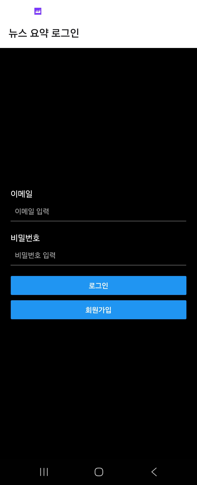
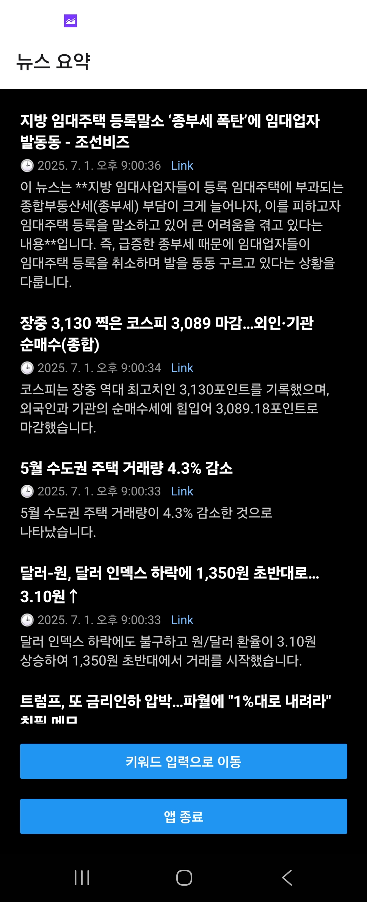
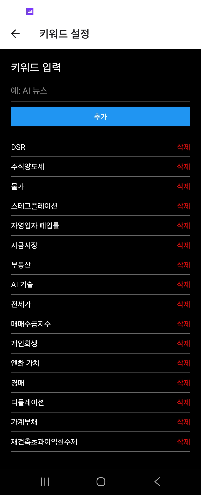

# 📰 News Summary App

Google News 기반 키워드 뉴스 수집 + Gemini 요약 → Firestore 저장  
React Native 앱을 통해 요약 결과 확인 및 키워드 관리 가능.

> 📋 Cross-project 운영 / 보안 / 정책은 [palab-platform](https://github.com/blcktgr73/palab-platform) (Private)에서 통합 관리됩니다.

## 🔧 구성 요소
- FastAPI + Cloud Run (백엔드)
- Gemini 요약 + Firestore 저장 (Cloud Function)
- Pub/Sub + Scheduler로 자동화
- Firebase Auth 기반 사용자 인증 (email)
- React Native Expo 기반 Frontend

## 📁 디렉토리 구조

```
GCPNewsProtal/
├── backend/
├── news_summarizer/
├── rigger_function/
├── frontend/
└── .github/
    └── workflows/
```

## 🏗️ 배포 대상
- GCP: Cloud Run, Cloud Functions, Firestore, Scheduler, Pub/Sub

## 동작 화면
로그인 화면


뉴스요약 화면


키워드 입력 화면
